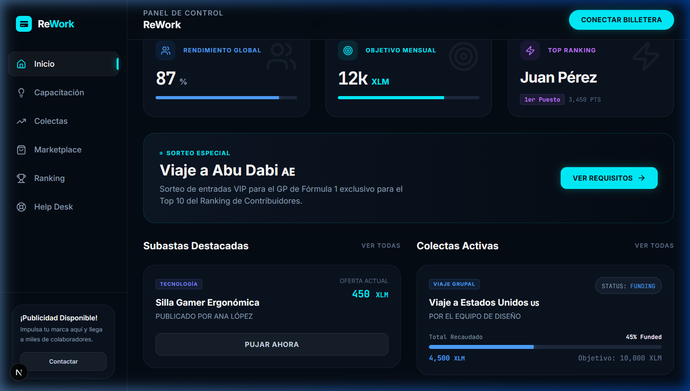
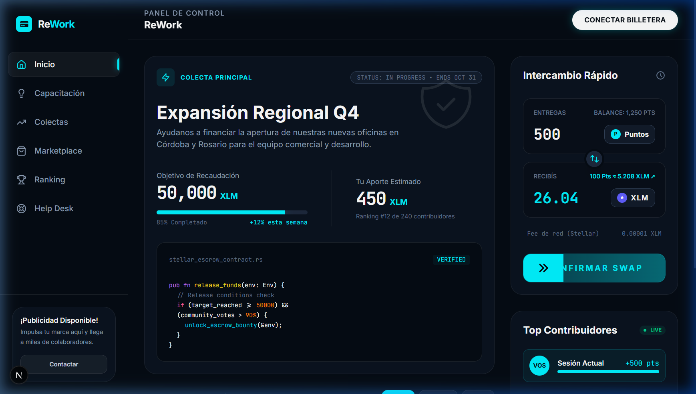
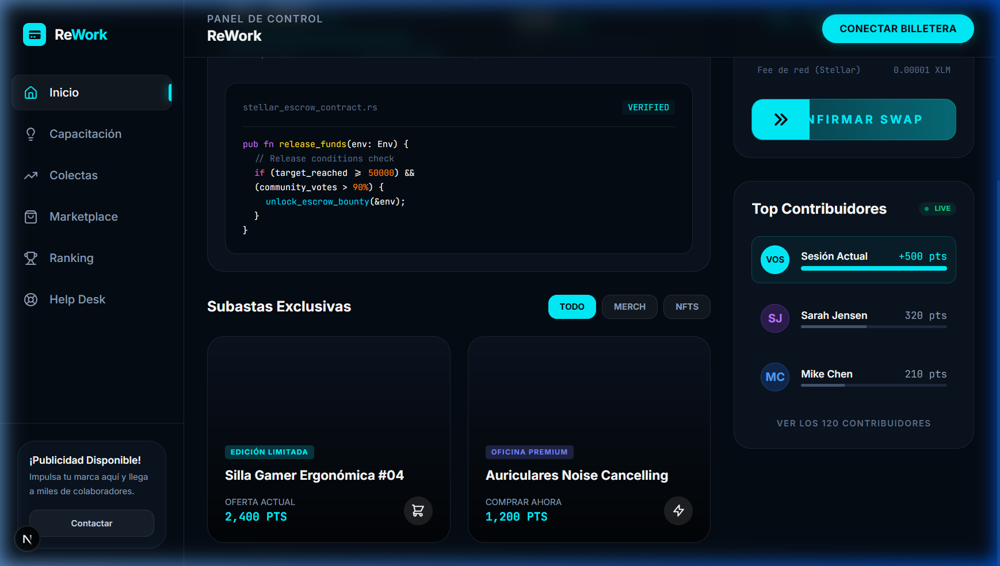
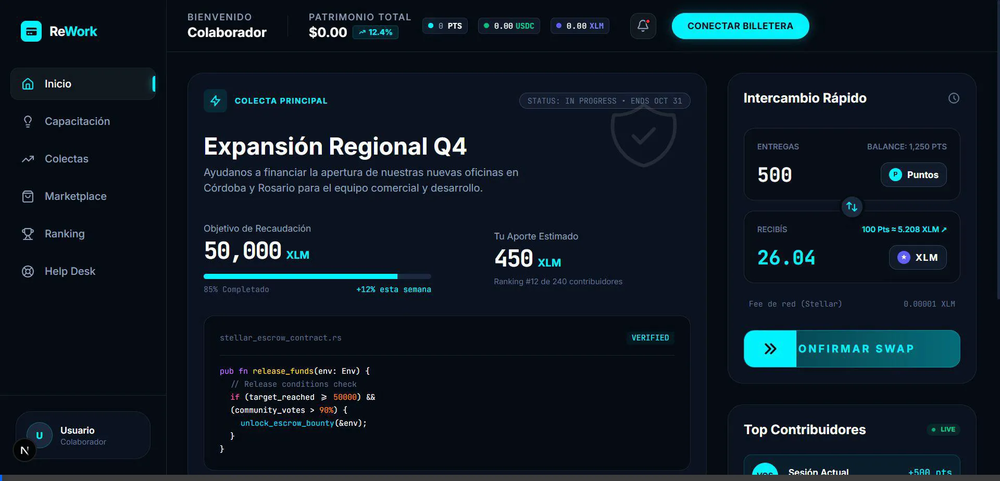
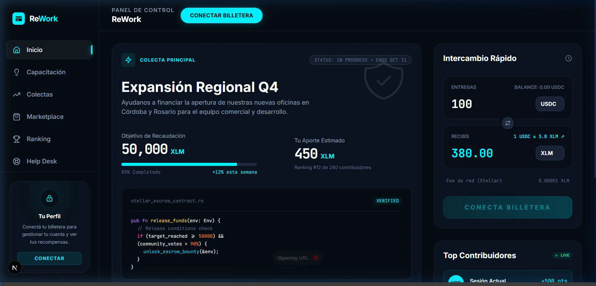

# ReWork Design Update Verification

The premium "CryptoDash" design system extracted from Stitch has been successfully applied to the ReWork dashboard.

## Key Changes Implemented

1. **Global Styles & Typography**:
   - Replaced basic dark mode with the deep `var(--color-deep-navy)` background.
   - Introduced `JetBrains Mono` for all data points, points balances, and metrics.
   - Applied global `.custom-scrollbar` to match the exact aesthetic.

2. **Components**:
   - **Sidebar**: Now uses the deep navy background with active glassy highlights on navigation items and a neon teal accent on the logo.
   - **Header**: Features a backdrop-blur effect and a glowing, pill-shaped "Conectar Billetera" button.
   - **Main Dashboard Cards**: Replaced solid borders with `.glass-card` styles, soft neon glows (`.glow-teal`), and exact spacing matching the 12-column grid.

## Visual Verification

Below are screenshots of the original global update:

---

## VaultX Layout Integration
Re-structured the dashboard into the precise 2-column "VaultX" layout requested:

- **Left Column**: Main Feature Card (Colecta Principal with Smart Contract preview) & Market Highlights (Subastas Exclusivas).
- **Right Column**: Swap Widget (Intercambio Rápido) & Active Contributors (Top Contribuidores).

---

## Responsive Design

The application has been fully optimized for mobile devices:

1.  **Mobile Navigation**:
    - Added a hamburger menu that toggles an animated, slide-in sidebar.
    - Included a backdrop that obscures the main content and allows closing the sidebar by tapping outside.
2.  **Dashboard Refinements**:
    - Grid columns wrap nicely on smaller screens (e.g., from `grid-cols-2` down to 1 column).
    - Reduced excessive padding to optimize screen real estate.
3.  **Marketplace Adaptations**:
    - Filter controls (Search, Sort, Hide Finished) and action buttons ("Crear") stack gracefully.
    - Auction cards adjust their width to fit mobile viewports.
4.  **Modals**:
    - "Crear Subasta" and Profile Modals maintain full functionality on mobile displays, ensuring inputs and buttons stack correctly.

### Mobile Verification Video

---

## Swap Widget (Intercambio Rápido) Funcionalidad

El widget de intercambio rápido en el dashboard fue completamente refactorizado:
1. **Selección de Tokens Dinamica**: Los usuarios ahora pueden cambiar entre USDC, XLM y Puntos (PTS).
2. **Saldos Reales**: Se integró el hook `useBalances` para mostrar los saldos en tiempo real de Stellar (Testnet).
3. **Cálculos Interactivos**: Las tasas de cambio se calculan en vivo (mockeadas) según el token de origen, destino, y la cantidad ingresada.
4. **UX Premium & Gamification**: El botón "Confirmar Swap" incluye hooks visuales interactivos (hover animations, colores neón). Cuando el intercambio es exitoso, se limpia el formulario y dispara una alerta temporal de puntos con efecto *confetti* usando el componente `sonner`.

### Demostración Modalidad Desktop

---

## Home & Colectas Integration

El Dashboard principal (Home) ahora integra funcionalidad real conectada a Supabase:
1. **Marketplace (Ex-Subastas Exclusivas)**: Muestra productos dinámicos con soporte para filtrar por "NUEVO" o "USADO". Posee un *lightbox* (modal interactivo) para ver detalles e interactuar con el producto.
2. **Colecta Principal ("Asado de equipo")**: Refleja datos reales del progreso (ej. 150 USDC) y soporte para mostrar el código de Contrato Inteligente (Trustless Work Escrow) al instante mediante un botón de verificación integrado.
3. **Página de Colectas Dedicada**: Se corrigió el listado, mostrando dinámicamente colectas tasadas con XLM o USDC según la campaña, y calculando los porcentajes de meta exitosamente.

### Demostración de Navegación

