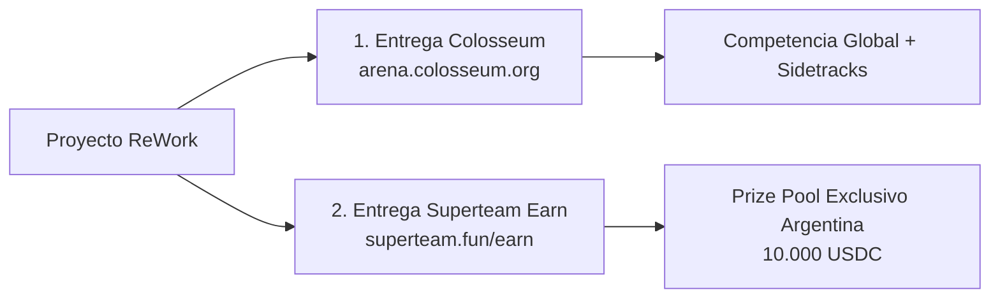

# Superteam Argentina Track · Crypto World's Fair (Colosseum Hackathon)

> **Documento Maestro de Contexto, Reglas, Entregas y Estrategia Técnica para ReWork**  
> *Track Oficial de Superteam Argentina en Crypto World's Fair (Colosseum Global Hackathon)*  
> **Fechas:** 28 de Septiembre — 12/13 de Octubre de 2026 | **Prize Pool:** 10.000 USDC

---

## 📌 Índice de Contenidos
1. [Resumen Ejecutivo & Visión](#1-resumen-ejecutivo--visión)
2. [Cronograma, Hitos & Eventos Clave](#2-cronograma-hitos--eventos-clave)
3. [Estructura Obligatoria de las Dos Entregas](#3-estructura-obligatoria-de-las-dos-entregas-dual-submission)
4. [Premios & Categorías de Evaluación](#4-premios--categorías-de-evaluación)
5. [Criterios de Evaluación & Causales de Descalificación](#5-criterios-de-evaluación--causales-de-descalificación)
6. [Estrategia Técnica de ReWork en Solana](#6-estrategia-técnica-de-rework-en-solana)
7. [Documentación de Soporte y Archivos Vinculados](#7-documentación-de-soporte-y-archivos-vinculados)
8. [Checklist Operativo de Ejecución](#8-checklist-operativo-de-ejecución)

---

## 1. Resumen Ejecutivo & Visión

El **Superteam Argentina Track** forma parte de **Crypto World's Fair**, el hackathon global de **Colosseum** en el ecosistema **Solana**. Su propósito es impulsar proyectos concebidos o co-fundados en Argentina con ambición de competir y ganar a nivel global.

- **Premisa fundamental:** *"Ideas can enter. Working products win."* No alcanza con una landing page o pitch deck; se exige un **producto funcional** que demuestre la experiencia central del usuario en Solana.
- **Tesis de ReWork en Solana:** ReWork integra a Solana como riel de alta velocidad y bajo costo para pagos de freelancers, custodia/escrow programable y micropagos, combinando onboarding Web2 sin fricción (wallets embebidas con Privy) y experiencia Web3 nativa (Phantom, Solflare, Wallet Standard).
- **Alcance geográfico:** Founders o equipos con al menos un co-founder residente en Argentina (en cualquier parte del país).

---

## 2. Cronograma, Hitos & Eventos Clave

| Fecha | Instancia / Evento | Descripción & Objetivos |
| :--- | :--- | :--- |
| **28/09 — 12/10** | **Superteam Argentina Cohort** | Hub online oficial, workshops, soporte técnico y seguimiento continuo. |
| **30/09 — 02/10** | **Workshop Week** | 3 jornadas: (1) Negocio & GTM, (2) Solana & Tech, (3) AI & Tech. |
| **02/10 — 04/10** | **Build Station Buenos Aires & Regionales** | Fin de semana intensivo (Café Nómada Villa Crespo + remoto + 6 ciudades).<br>• *Dom 04/10 16:00:* Cierre preselección para Demo Day.<br>• *Dom 04/10 19:30:* **Demo Day** de preseleccionados. |
| **05/10 — 11/10** | **Mentorship Top Talent** | Acompañamiento 1-on-1 para los 10 mejores equipos preseleccionados (producto, tech, UX, pitch y revisión de repo). |
| **12/10 (23:59 ART)** | 🚨 **DEADLINE ENTREGA SUPERTEAM EARN** | **Cierre definitivo del track de Superteam Argentina** para competir por los 10.000 USDC. |
| **13/10 (03:59 ART / 23:59 UTC)** | 🚨 **DEADLINE GLOBAL COLOSSEUM** | Cierre global de la plataforma Colosseum (Crypto World's Fair). |
| **< 28/10/2026** | **Anuncio de Ganadores** | Publicación oficial de los ganadores de los 10.000 USDC y menciones especiales. |

---

## 3. Estructura Obligatoria de las Dos Entregas ("Dual Submission")

Para ser elegible y competir por los premios, **el proyecto debe ser presentado en dos plataformas**:



### 1. Entrega en Colosseum (arena.colosseum.org)
- **Idioma Mandatorio:** **TODO en INGLÉS** (descripciones, videos, documentación y comentarios clave del repo).
- **Checklist de Entrega:**
  1. **Video de Pitch (2 minutos):** Presentación del equipo, problema que resuelve ReWork, solución y modelo.
  2. **Video de Demo (hasta 3 minutos):** Demostración del producto en funcionamiento real en pantalla (flujo de contratación/pago/escrow).
  3. **Nombre y descripción corta:** Resumen conciso en 2 líneas.
  4. **Logo / Key Visual:** Imagen y assets de presentación.
  5. **Blockchains & Herramientas:** Detalle técnico de la integración en Solana (Wallets, SPL Tokens/Token-2022, RPC Triton, Anchor, etc.).
  6. **Repositorio GitHub:** Público, o privado compartiendo acceso con `hackathon@superteam.ar` y `hackathon@colosseum.com`.
  7. **GTM & Validación:** Estrategia de distribución, usuarios objetivo, métricas, feedback de testers o compromisos reales.
  8. **Perfil del Equipo:** Miembros con experiencia, y **ubicación del proyecto configurada explícitamente en Argentina**.

### 2. Entrega en Superteam Earn
- Registro del proyecto en el listing específico del track de Argentina en Superteam Earn.
- Permite al jurado local auditar el historial de cambios, compromiso y tracción del equipo en el territorio.

---

## 4. Premios & Categorías de Evaluación

**Pozo Total: 10.000 USDC** (Superteam Argentina Track).  
*Nota: Los premios especiales son acumulativos con los puestos principales.*

| Puesto / Mención | Monto (USDC) | Enfoque de Evaluación |
| :--- | :--- | :--- |
| **1.º Puesto** | **3.000 USDC** | Mejor proyecto integral (producto, tracción, rol de Solana y potencial global). |
| **2.º Puesto** | **2.000 USDC** | Segundo mejor proyecto integral. |
| **3.º Puesto** | **1.500 USDC** | Tercer mejor proyecto integral. |
| **4.º Puesto** | **1.000 USDC** | Cuarto puesto general. |
| **5.º Puesto** | **500 USDC** | Quinto puesto general. |
| **Best Product / UX** | **500 USDC** | Experiencia más clara, intuitiva, onboarding pulido y diseño consistente. |
| **Most Traction** | **500 USDC** | Mayor tracción verificable durante el hackathon (usuarios reales, feedback, compromisos de pago). |
| **Best Demo Day Pitch** | **500 USDC** | Mejor presentación, claridad narrativa y defensa del producto funcionando. |
| **University Award** | **500 USDC** | Proyecto destacado con participación sustancial de al menos un estudiante universitario argentino. |

---

## 5. Criterios de Evaluación & Causales de Descalificación

### Qué evalúa el jurado de Colosseum & Superteam:
1. **Fit Founder–Mercado:** Conocimiento íntimo del problema de freelancers/clientes y capacidad del equipo para resolverlo.
2. **Insight Único:** Comprensión profunda de por qué las alternativas actuales fallan y por qué Solana es la solución.
3. **Producto y Ejecución Técnica:** Calidad del código, arquitectura, seguridad, manejo de transacciones y robustez.
4. **Tamaño del Mercado:** Potencial de escalabilidad internacional.
5. **Comunicación del Founder:** Claridad al explicar el producto en 2 minutos.
6. **Viabilidad:** Factibilidad técnica y económica post-hackathon.
7. **Tracción Verificable:** Pruebas reales de uso, feedback documentado y usuarios activos.

### 🚨 Motivos de Descalificación Oficial:
- ❌ Contenido no presentado en **inglés** en Colosseum.
- ❌ Miembros del equipo o proyecto registrados sin **Argentina** como país/ubicación.
- ❌ Un participante anotado en múltiples equipos, o un equipo presentando más de un proyecto.
- ❌ Entrega posterior al límite de tiempo (12/10 23:59 ART).
- ❌ Métricas, usuarios o transacciones **falsificadas** (se auditan contratos y analytics).
- ❌ No declarar el punto de partida (código previo sin distinguir del trabajo del hackathon).

---

## 6. Estrategia Técnica de ReWork en Solana

ReWork evoluciona como una plataforma multi-cadena de trabajo y pagos, adoptando el estándar moderno recomendado por Superteam:

```mermaid
graph TD
    Client[Frontend Next.js App] --> Auth[Autenticación Híbrida]
    Auth --> Privy[Privy Social Login / Embedded Solana Wallet]
    Auth --> NatWallets[Solana Wallet Standard\nPhantom / Solflare]
    Client --> KitSDK[@solana/kit v8+\nModular Client]
    KitSDK --> TritonRPC[Triton RPC Node\n.env.local]
    TritonRPC --> SolanaDevnet[Solana Devnet]
    SolanaDevnet --> SPLTokens[USDC nativo en Solana\nSPL Token / Token-2022]
    SolanaDevnet --> EscrowProgram[Anchor Escrow Program / Smart Contracts]
```

### Reglas Técnicas Mandatorias (ver [`SOLANA-RULES.md`](../SOLANA-RULES.md)):
1. **SDK Cliente:** Usar **`@solana/kit`** v8+ con arquitectura de plugins (`createClient().use(...)`). Evitar `@solana/web3.js` v1 legacy en código nuevo.
2. **Smart Contracts:** Programas en **Anchor**. Validar siempre cuentas con discriminadores, constraints, seeds canónicas y aritmética `checked_*`.
3. **Wallets & Onboarding:**
   - **Privy Embedded Wallets:** Para usuarios Web2 (login con correo/social, creando una wallet Solana sin custodia ni fricción).
   - **Wallet Standard:** Para usuarios Web3 con Phantom, Solflare, Backpack.
   - **Gasless/Sponsorship:** El usuario no debe lidiar obligatoriamente con SOL para transaccionar en USDC.
4. **Red & RPC:**
   - Red por defecto: **Devnet**.
   - RPC dedicado: **Triton** (clave configurada en `.env.local`, nunca harcodeada ni subida al repo).
5. **Testing:**
   - Unit tests: LiteSVM o Mollusk.
   - Integración: Surfpool o devnet smoke tests.

---

## 7. Documentación de Soporte y Archivos Vinculados

- [`docs/ROADMAP_HACKATHON_COLOSSEUM.md`](./ROADMAP_HACKATHON_COLOSSEUM.md): **Hoja de ruta operativa detallada, checklist paso a paso y borrador listo para el formulario de preselección del 4 de octubre**.
- [`SOLANA-RULES.md`](../SOLANA-RULES.md): Reglas estrictas de codificación, stack, cuentas, seguridad y clientes para agentes de IA y desarrolladores.
- [`docs/solana_stack_guide.md`](./solana_stack_guide.md): Guía completa de Superteam Argentina con arquitectura, buenas prácticas, seguridad y recetas de 24hs.
- [`docs/CHANGELOG_COLOSSEUM.md`](./CHANGELOG_COLOSSEUM.md): Registro de punto de partida (starting point disclosure) y changelog semanal de progreso durante el hackathon.

---

## 8. Checklist Operativo de Ejecución

- [ ] **Paso 1: Registros Individuales y de Proyecto**
  - [ ] Cada integrante registrado en Colosseum con país **Argentina**.
  - [ ] Proyecto registrado en Colosseum con ubicación **Argentina**.
  - [ ] Inscripción en el hub de Luma ([luma.com/superteamar](https://luma.com/superteamar)).
  - [ ] Proyecto registrado en Superteam Earn.
- [ ] **Paso 2: Transparencia & Starting Point**
  - [ ] Completar [`docs/CHANGELOG_COLOSSEUM.md`](./CHANGELOG_COLOSSEUM.md) con el estado inicial del proyecto al 28/09.
- [ ] **Paso 3: Desarrollo & Solana Integration**
  - [ ] Configurar `@solana/kit` y soporte de Solana en el módulo de wallets.
  - [ ] Implementar flujo de escrow o pago de servicios en USDC sobre Solana Devnet.
  - [ ] Configurar endpoint RPC privado de Triton en `.env.local`.
- [ ] **Paso 4: Validación y Tracción**
  - [ ] Conseguir 3-5 testeos reales de freelancers/empleadores locales con feedback documentado.
- [ ] **Paso 5: Materiales Audiovisuales (en Inglés)**
  - [ ] Grabar video de Pitch (exactamente <= 2 minutos).
  - [ ] Grabar video de Demo interactiva (hasta 3 minutos mostrando Solana en pantalla).
- [ ] **Paso 6: Doble Entrega Final**
  - [ ] Subir formulario y entrega en Colosseum antes del 12/10 23:59 ART.
  - [ ] Confirmar entrega en Superteam Earn.
